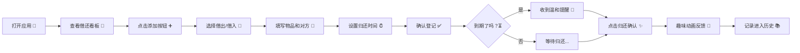

## 1. 产品概述

室友物品借还追踪板是一款专为合租/宿舍场景设计的轻松有趣的物品借还管理工具。帮助室友们轻松追踪谁借了谁的洗衣液、充电器、吹风机等物品，借出时一键登记，归还时勾销，让借还物品不再"失忆"。

- **核心价值**：解决合租生活中物品借还混乱、遗忘归还的痛点，让室友关系更和谐
- **目标用户**：合租室友、大学宿舍舍友
- **产品调性**：轻松、幽默、温暖，带表情包式的友好交互

## 2. 核心功能

### 2.1 用户角色
| 角色 | 注册方式 | 核心权限 |
|------|----------|----------|
| 普通用户 | 无需注册，本地使用 | 添加/编辑/删除借还记录，设置归还时间，查看提醒 |

### 2.2 功能模块
1. **借还看板主页**：展示进行中的借出和借入记录，一目了然
2. **快速登记**：一键添加借还记录，支持选择物品、对方、时间
3. **归还确认**：点击即可完成归还，附带趣味反馈动画
4. **到期提醒**：设置预期归还时间，到期自动温和提醒
5. **历史记录**：查看所有已完成的借还历史
6. **室友管理**：添加/编辑室友信息，方便快速选择

### 2.3 页面详情
| 页面名称 | 模块名称 | 功能描述 |
|----------|----------|----------|
| 借还看板 | 头部统计区 | 显示借出/借入数量统计，今日到期提醒数 |
| 借还看板 | 进行中卡片列表 | 卡片式展示所有进行中的借还记录，支持分类筛选 |
| 借还看板 | 快速添加按钮 | 浮动添加按钮，点击弹出登记表单 |
| 借还看板 | 历史记录入口 | 点击展开/收起历史记录列表 |
| 登记弹窗 | 借/还切换 | 切换借出或借入模式 |
| 登记弹窗 | 物品选择 | 输入物品名称，支持常用物品快捷选择 |
| 登记弹窗 | 室友选择 | 选择对方室友，支持快速添加新室友 |
| 登记弹窗 | 归还时间 | 设置预期归还时间，提供快捷选项（1天/3天/1周/自定义） |
| 登记弹窗 | 备注 | 可选备注信息 |
| 详情弹窗 | 记录详情 | 展示借还详情，支持编辑和删除 |
| 详情弹窗 | 归还确认 | 大按钮确认归还，带动画和表情包反馈 |
| 室友管理 | 室友列表 | 展示所有已添加的室友，支持编辑删除 |

## 3. 核心流程

用户打开应用 → 查看借还看板 → 点击添加按钮 → 选择借出/借入 → 填写物品和对方 → 设置归还时间 → 确认登记 → 到期收到提醒 → 点击归还确认 → 趣味动画反馈 → 记录进入历史

## 4. 用户界面设计

### 4.1 设计风格
- **设计调性**：轻松活泼、温暖治愈、带点小幽默
- **主色调**：柔和的暖橙色系（#FF8C69 为主色），搭配奶油白和浅灰
- **辅助色**：薄荷绿（成功/归还）、珊瑚粉（提醒/借出）、淡紫色（借入）
- **按钮风格**：圆润胶囊形按钮，带轻微阴影和按压动效
- **字体**：使用圆润友好的中文字体（如霞鹜文楷或类似圆润字体）
- **布局风格**：卡片式布局，柔和圆角，轻微悬浮阴影
- **表情元素**：大量使用emoji表情包作为视觉点缀和交互反馈

### 4.2 页面设计概述
| 页面名称 | 模块名称 | UI元素 |
|----------|----------|--------|
| 借还看板 | 头部统计区 | 渐变色背景，统计数字大号显示，图标+数字组合 |
| 借还看板 | 进行中卡片 | 白卡背景，柔和阴影，左侧彩色状态条，物品名大字，对方和时间小字 |
| 借还看板 | 浮动添加按钮 | 圆形渐变按钮，+号图标，悬停放大效果 |
| 登记弹窗 | 表单区域 | 圆角输入框，标签式切换，快捷选择标签 |
| 详情弹窗 | 归还按钮 | 大尺寸渐变按钮，点击有烟花/表情包动画 |
| 历史记录 | 列表项 | 灰色调，带删除线效果，显示完成时间 |

### 4.3 响应式
- **桌面优先**：最大宽度限制在600px左右，居中展示，模拟手机端体验
- **移动端适配**：完美适配手机屏幕，全宽展示
- **触摸优化**：按钮尺寸≥44px，间距合理，适合手指点击

### 4.4 交互细节
- **添加动画**：卡片从下往上滑入，带轻微弹性
- **归还动画**：卡片变灰+缩小，伴随庆祝emoji弹出
- **提醒效果**：到期记录轻微闪烁，边框变为提醒色
- **空状态**：可爱的空状态插画+幽默文案
- **悬停效果**：卡片轻微上浮，阴影加深
