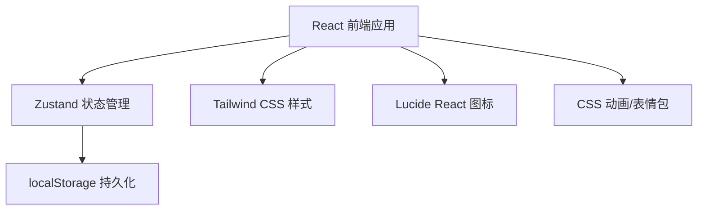
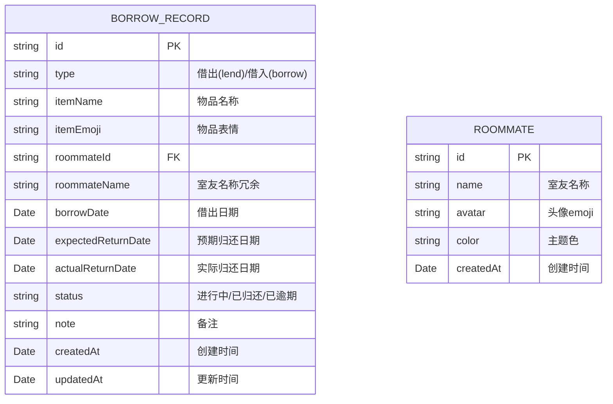

## 1. 架构设计

本项目为纯前端应用，数据存储在浏览器 localStorage 中，无需后端服务。采用 React + TypeScript + Vite 技术栈，使用 Zustand 进行状态管理，Tailwind CSS 进行样式开发。



## 2. 技术描述

- **前端框架**：React@18 + TypeScript
- **构建工具**：Vite@5
- **状态管理**：Zustand@4
- **样式方案**：Tailwind CSS@3
- **图标库**：Lucide React
- **数据存储**：浏览器 localStorage（纯前端，无后端）
- **初始化工具**：vite-init（react-ts 模板）

## 3. 路由定义

| 路由 | 用途 |
|------|------|
| / | 借还看板主页（单页应用，无路由切换） |

> 注：本项目为单页应用，通过弹窗/模态框实现不同功能界面的切换，无需多路由。

## 4. 数据模型

### 4.1 数据模型定义



### 4.2 TypeScript 类型定义

```typescript
// 借还类型
type BorrowType = 'lend' | 'borrow';

// 状态类型
type BorrowStatus = 'active' | 'returned' | 'overdue';

// 室友
interface Roommate {
  id: string;
  name: string;
  avatar: string; // emoji
  color: string;
  createdAt: string;
}

// 借还记录
interface BorrowRecord {
  id: string;
  type: BorrowType; // lend=我借出, borrow=我借入
  itemName: string;
  itemEmoji: string;
  roommateId: string;
  roommateName: string;
  roommateAvatar: string;
  borrowDate: string;
  expectedReturnDate: string;
  actualReturnDate?: string;
  status: BorrowStatus;
  note?: string;
  createdAt: string;
  updatedAt: string;
}

// Store 状态
interface BorrowStore {
  records: BorrowRecord[];
  roommates: Roommate[];
  filter: 'all' | 'lend' | 'borrow' | 'overdue';
  showHistory: boolean;
  
  // Actions
  addRecord: (record: Omit<BorrowRecord, 'id' | 'createdAt' | 'updatedAt' | 'status'>) => void;
  returnRecord: (id: string) => void;
  deleteRecord: (id: string) => void;
  updateRecord: (id: string, updates: Partial<BorrowRecord>) => void;
  addRoommate: (roommate: Omit<Roommate, 'id' | 'createdAt'>) => void;
  deleteRoommate: (id: string) => void;
  setFilter: (filter: BorrowFilter) => void;
  toggleHistory: () => void;
  checkOverdue: () => void;
}
```

## 5. 项目结构

```
src/
├── components/          # 组件目录
│   ├── Header.tsx       # 头部统计区
│   ├── BorrowCard.tsx   # 借还记录卡片
│   ├── RecordList.tsx   # 记录列表
│   ├── AddRecordModal.tsx  # 添加记录弹窗
│   ├── RecordDetailModal.tsx # 记录详情弹窗
│   ├── RoommateManage.tsx   # 室友管理
│   ├── FilterTabs.tsx   # 筛选标签
│   └── Celebration.tsx  # 庆祝动画组件
├── store/               # 状态管理
│   └── useBorrowStore.ts
├── hooks/               # 自定义 Hooks
│   └── useReminder.ts   # 提醒 Hook
├── utils/               # 工具函数
│   ├── storage.ts       # localStorage 封装
│   ├── date.ts          # 日期工具
│   └── emoji.ts         # 表情包工具
├── types/               # 类型定义
│   └── index.ts
├── data/                # 模拟数据/常量
│   ├── mockData.ts      # 初始模拟数据
│   └── constants.ts     # 常量配置
├── App.tsx              # 主应用组件
├── main.tsx             # 入口文件
└── index.css            # 全局样式
```

## 6. 功能实现要点

### 6.1 到期提醒机制
- 页面加载时检查所有进行中的记录
- 对比当前日期和预期归还日期
- 逾期记录标记为红色并添加闪烁动画
- 页面顶部显示今日到期提醒数量
- 使用 `setInterval` 每分钟检查一次（可选）

### 6.2 表情包系统
- 常用物品预设 emoji（洗衣液🧴、充电器🔌、吹风机💨等）
- 归还成功随机弹出庆祝 emoji 动画（🎉✨🎊🥳）
- 空状态显示幽默文案+可爱 emoji
- 室友头像使用 emoji 表示

### 6.3 数据持久化
- 使用 Zustand 的 persist 中间件
- 数据存储在 localStorage 中
- 首次加载提供一些示例数据，方便体验
